####################
Calculation overview
####################

The following calculation explanations references the ramascene.analyze module code.

Pre-calculating the matrices
============================
To reduce calculation times and to reduce load on the server the Leontief inverse or total requirements matrix ( **L** )
is precalculated according:

.. image:: ystatic/image003.png

When storing the Leontief inverse as an intermediate result, calculations on the server are reduced to simple matrix –
matrix multiplication and the computational intense task of solving a system of linear equations or making a full matrix
inverse can be avoided.

The matrices that are stored for further calculation are **L** , **Y**  and **B**.
They are stored as binary objects in the form of numpy arrays.

The four calculation routes
===========================
If environmental impacts related to final consumption are analysed it is possible to compare the environmental impacts
from different points of view. We can compare the impact of consumed products between countries or between different
products. This is what is called the consumption based view. Or given a certain final consumption of products we can
calculate where the emissions are taking place and compare these between producing sector or countries. This is what we
call the production point of view. All in all we distinguish between four different ways comparisons can be made.
They are shown in Figure 1.

In each of the four calculation routes, the principal calculation that in each route is done is:

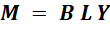

The way the resulting calculations are presented are however different each time. In route 1 the calculated indicators
results are presented per final consumed product. In route 2 the calculated indicator results are presented per
consuming country. In route 3 the results are presented per producing country and in route 4 they are presented per
produced product. For each route the  details are described below.

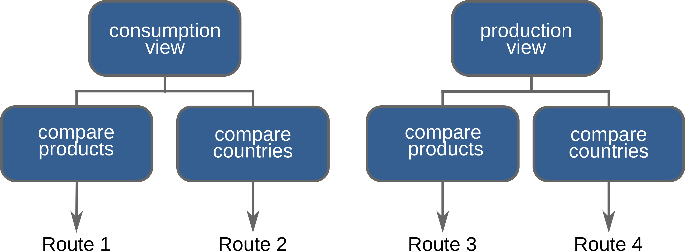

Figure 1: Consumption and production view and the corresponding calculation routes.

Route 1
=======
In this calculation route the user can compare the environmental impacts associated with the final consumption of
different products in a set of selected countries. Environmental impacts generated by production in all countries and
by the production of all products are taken into account.

The calculation route has been designed for general application. It can calculate the environmental impacts of different
products given a specific selected country selling final product or specific country where the emission takes place or
specific sector where the emission takes place. However the actual implementation of route 1 takes into account that
country selling product are all countries, the country where the emission takes place are all countries and the emission
at all sectors are taken into account.

The calculation starts by creating the final demand vector that contains the selected products for the selected
countries.

The symbol **Y** represents the multi-regional final demand matrix, that can be subdivided into sub-vectors that contain
final
demand for domestically produced products and final demand for imported products. In the final demand table there is no
further subdivision into final demand by households, changes in stocks etc. Assume that there are three countries:

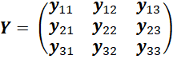

And the consuming country 1 and 3 have been selected then Y first becomes:

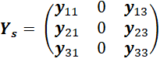

where the subscript **s** stands for selected elements. Subsequently the total final demand for each product is calculated:

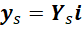

Where **i** is a column vector of ones of appropriate length.

It is important to note that the user selects a product without specifying the origin of a product.
For instance, if a user selects wheat as a product of interest, in the final demand vector wheat from every
origin is selected i.e. wheat from Austria, wheat from Belgium etc.

For each of the final consumed products selected the output from each sector ( **X** ) needed to produce that
product is calculated as:

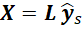

At this point it is possible to make a sub-selection from **X**  to select only the output in countries and sectors that are
of interest to the user. For instance if we assume a three country case **X** can be expressed as:

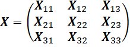

If we’re only interested in the activities  taking place in country 1 as a result of the selected final consumption of
products then the subselection is:

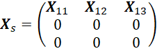

The next step is calculating the selected indicator:

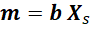

where **m** is a vector of the impacts  associated with each of the selected final consumed products given a certain
selected region and sector where the emission takes place.

There is one last step to make. The user does not specify the geographical origin of a product. For instance
if the user selects “rice” the actual product selected are “rice from Italy”, “rice from Taiwan”. The **m** vector with a
length of 49 countries times 200 products needs to be aggregated into 200 product groups:

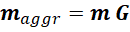

where **G** is an appropriate aggregation matrix.

In practice for the consumption based view the sector and region where the emission takes place is always set to all
sectors and all regions. However the code allows to make sub selections.

Route 2
=======
In route 2 the environmental impacts of final consumption is compared between countries for a selected set of products.
Again environmental impacts generated by production in all countries and by the production of all products are taken
into account.

The calculation route has been designed for general application. It can calculate the environmental impacts of different
products given a specific selected country selling final product or specific country where the emission takes place or
specific sector where the emission takes place. However the actual implementation of route 2 takes into account that
country selling product are all countries, the country where the emission takes place are all countries and the emission
at all sectors are taken into account.

The calculation starts by creating the final demand vector that contains the selected products for the selected countries.

The symbol **Y** represents the multi-regional final demand matrix, that can be subdivided into subvectors that contain total
final demand for domestically produced products and total final demand for imported products. Assume that there are
three countries:

And the consuming country 1 and 3 have been selected then Y first becomes:

where the subscript **s** stands for selected elements.

It is important to note that the user selects a product without specifying the origin of a product.
For instance, if a user selects wheat as a product of interest, in the final demand vector wheat from every
origin is selected i.e. wheat from Austria, wheat from Belgium etc.

For each of the selected countries, the output from each sector ( **X** ) needed to produce that final demand for a
country is calculated as:

.. image:: ystatic/image041.png

At this point it is possible to make a sub-selection from **X** to select only the output in countries and sectors that are of
interest to the user. For instance if we assume a three country case **X** can be expressed as:

If we’re only interested in the activities  taking place in country 1 as a result of the selected final consumption of
products then the subselection is:

The next step is calculating the selected indicator:

where **m** is a vector of the impacts associated with each of the countries selected final demand.

Route 3
=======
Using this calculation route the user can compare the emissions taking place in different countries given a
certain selected final demand. For instance it is possible to see in which countries emissions take place as a
result of final consumption in the USA.

The calculation route has been designed for general application. It can calculate the environmental impacts of
different products given a specific selected country selling final product or specific country where the emission
takes place or specific sector where the emission takes place. However the actual implementation of route 3 takes
into account that country selling product are all countries, the country where the emission takes place are all
countries and the emission at all sectors are taken into account.

The calculation starts by creating the final demand vector that contains the selected products for the selected countries.

The **Y** symbol represents the multi-regional final demand matrix, that can be subdivided into subvectors that contain
total final demand for domestically produced products and total final demand for imported products. Assume that there
are three countries:

And the consuming country 1 and 3 have been selected then Y first becomes:

where the subscript **s** stands for selected elements.

It is important to note that the user selects a product without specifying the origin of a product. For instance, if a
user selects wheat as a product of interest, in the final demand vector wheat from every origin is selected i.e. wheat
from Austria, wheat from Belgium etc.

Following the selection of final consumed products in a selected number of countries the final demand matrix is summed
to get total final demand for each product:

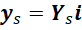

The output needed to satisfy this final demand is subsequently calculated according:

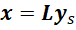

The vector **x** contains all possible product outputs and has a length of 49 countries times 200 products.
The emissions or impact indicators are calculated by multiplying selected emission coefficients or selected indicator
coefficients with the diagonalised output vector:

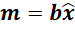

The vector **m** is subsequently aggregated into emission or indicators per country

.. image:: ystatic/image038.png

where **G** is an appropriate aggregation matrix.

Route 4
=======
Using this calculation route the user can compare the emissions associated with different product outputs
given a certain selected final demand. For instance it is possible to see in which product output has the
highest emissions as a result of final consumption in the USA. This calculation route starts in the same way
as calculation Route 3 but the aggregation step at the end differs from route 1.

The calculation route has been designed for general application. It can calculate the environmental impacts
of different products given a specific selected country selling final product or specific country where the
emission takes place or specific sector where the emission takes place. However the actual implementation of
route 4 takes into account that country selling product are all countries, the country where the emission takes
place are all countries and the emission at all sectors are taken into account.

The calculation starts by creating the final demand vector that contains the selected products for the selected countries.

The symbol **Y** represents the multi-regional final demand matrix, that can be subdivided into subvectors that contain
total final demand for domestically produced products and total final demand for imported products. Assume that there
are three countries:

And the consuming country 1 and 3 have been selected then Y first becomes:

where the subscript **s** stands for selected elements.

It is important to note that the user selects a product without specifying the origin of a product. For instance,
if a user selects wheat as a product of interest, in the final demand vector wheat from every origin is selected i.e.
wheat from Austria, wheat from Belgium etc.

Following the selection of final consumed products in a selected number of countries the final demand matrix is summed
to get total final demand for each product:

The output needed to satisfy this final demand is subsequently calculated according:

The vector **x** contains all possible product outputs and has a length of 49 countries times 200 products.
The emissions or impact indicators are calculated by multiplying selected emission coefficients or selected indicator
coefficients with the diagonalised output vector:

The vector **m** is subsequently aggregated into emission or indicators per country

.. image:: ystatic/image038.png

where **G** is an appropriate aggregation matrix.