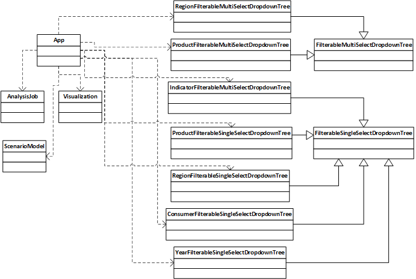
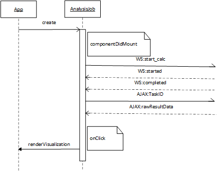
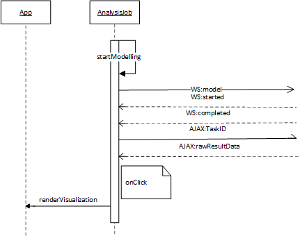

########
Frontend
########

The frontend uses the React framework.
The source javascript files are stored in the folder assets/js/client.
Webpack will build the distributables and places them in /assets/bundles.

Package Manager
===============
The used javascript package manager is yarn. Yarn uses package.json to create yarn.lock file.

Structure
=========

The main App component
----------------------

The main React component is defined in the file ramascene.js : this component defines the main page structure.
The main App component uses other sub components :

* **AnalysisJob** : displayed as a job in the Analysis queue panel
* **IndicatorFilterableSingleSelectDropdownTree** : displayed as the Indicator dropdown selectbox
* **ProductFilterableSingle-** and **ProductFilterableMultiSelectDropdownTree** : displayed as the products dropdown selectbox
* **RegionFilterableSingle-** and **RegionFilterableMultiSelectDropdownTree** : displayed as the region dropdown selectbox
* **ScenarioModel** : displayed as the content for the Scenario Modelling panel
* **Visualization** : displayed as the content for the Main and Comparison View panels
* **YearFilterableSingleSelectDropdownTree** : displayed as the year dropdown selectbox

The main App component also defines following constants :

+---------------+-------+------------------------------------------------------------------------------------------------+
| Constant      | Value | Description                                                                                    |
+===============+=======+================================================================================================+
| MAX_JOB_COUNT |    10 | max. number of jobs permitted in analysis queue                                                |
+---------------+-------+------------------------------------------------------------------------------------------------+
| WAIT_INTERVAL |  5000 | the time a message to the user is displayed when a new job is placed on the analysis job queue |
+---------------+-------+------------------------------------------------------------------------------------------------+

The main App component most important state variables :

* **jobs** : array of Analysis jobs
* **model_details** : array of scenario modelling changes

The main App component functions :

* **handleAnalyse()**                 : will push a new job on the analysis queue and shows a message for WAIT_INTERVAL time
* **handleModelling()**               :  will only show a message for WAIT_INTERVAL time
* **handleJobFinished()**             : hides the message
* **renderVisualization()**           : deselects the currently selected job, selects the new job  and renders the Visualization component
* **renderComparisonVisualization()** : almost the same functionality as renderVisualization
* **hideMainView()**                  : empties the main view panel
* **hideComparisonView()**            : empties the comparison view panel
* **deleteJob()**                     : deletes 1 job from analysis queue

The ScenarioModel component
---------------------------

This component makes it possible to add or remove changes to a new model_details structure and then save it to the model_details.
It is also possible to clear the model_details.

The ScenarioModel component uses other sub components :

* **ProductFilterableSingleSelectDropdownTree** : displayed as the products dropdown selectbox
* **ConsumerFilterableSingleSelectDropdownTree** : displayed as the 'consumed by' dropdown selectbox
* **RegionFilterableSingleSelectDropdownTree** : displayed as the 'originating from/where' dropdown selectboxes

The ScenarioModel component defines following constants :

+---------------+-------+------------------------------------------------------------------------------------------------+
| Constant      | Value | Description                                                                                    |
+===============+=======+================================================================================================+
| MAX_CHANGES   |     5 | max. number of changes a scenario can contain                                                  |
+---------------+-------+------------------------------------------------------------------------------------------------+

The main functions :

* **handleAddClick()**    : pushes a new change to the new model_details structure
* **handleRemoveClick()** : pops the last change from the new model_details structure
* **handleSaveClick()**   : saves the new model_details structure
* **handleClearClick()**  : clears the model_details structure

The AnalysisJob component
-------------------------

This component does all the Websocket and AJAX traffic.

The Analysis component most important state variables :

* **query** : contains the query

The main AnalysisJob component functions :

* **componentDidMount()** : this is a React lifecycle callback function which is called immediately after the component is inserted into the DOM tree. This function will set up the Websocket connection and sends the analysis query to the RaMa-scene server.
* **handleWebSocketResponse()** : called when a message is received on the websocket. The received data will be parsed as JSON. When job_status == 'started' the job name can be generated. When job_status == 'completed' an AJAX call is executed to retrieve the raw result data. Upon reception of the raw results, some preparation for CSV download are executed.
* **generateCSVdata()** : prepares the CSV data for download
* **startModelling()** : will set up a Websocket connection and sends the model_details to the RaMa-scene server.

The Visualization component
---------------------------

This component will render the result using D3plus package.
It uses 3 different topojson files for the geo map : one with a layer over the whole world, one with a layer per continent and one with a layer per individual country/region.

Dropdown Tree select
--------------------

Because it seems not possible to switch a multi-select to a single-select box with the rc-tree-select package we're using, two separate base classes are provided :

* **FilterableMultiSelectDropdownTree**
* **FilterableSingleSelectDropdownTree**

The FilterableSingle- and FilterableMultiSelectDropdownTree component most important state variables :

* **data** : contains the tree data
* **value** : contains the current selection
* **callback** : callback to be executed when onChange event occurs. For FilterableMultiSelectDropdownTree it first tries to execute a derived class's handleOnChange function.

The main functions :

* **filterCaseInsensitive()** : this function will return true if the inputValue and the treeNode label are the same text when ignoring the upper- or lowercase.

Most noticeable derived classes of FilterableMultiSelectDropdownTree are **ProductFilterableMultiSelectDropdownTree** and **RegionFilterableMultiSelectDropdownTree**.
The ProductFilterableMultiSelectDropdownTree overrides the render() function to add buttons for quickly select all items on one of the three tree levels.
The ProductFilterableMultiSelectDropdownTree component also implements the handleOnChange super class function which keeps care that a user doesn't mix selecting items from different tree levels.
The RegionFilterableMultiSelectDropdownTree also implements the handleOnChange super class function. It will take care of selecting only total/continent/country items depending on the 'Geographic aggregation level'.
If Country aggregation level is chosen and a continent is selected, then select all countries of that continent instead.
If Continent aggregation level is chosen and counties are selected, then select the continents to which these countries belong instead.