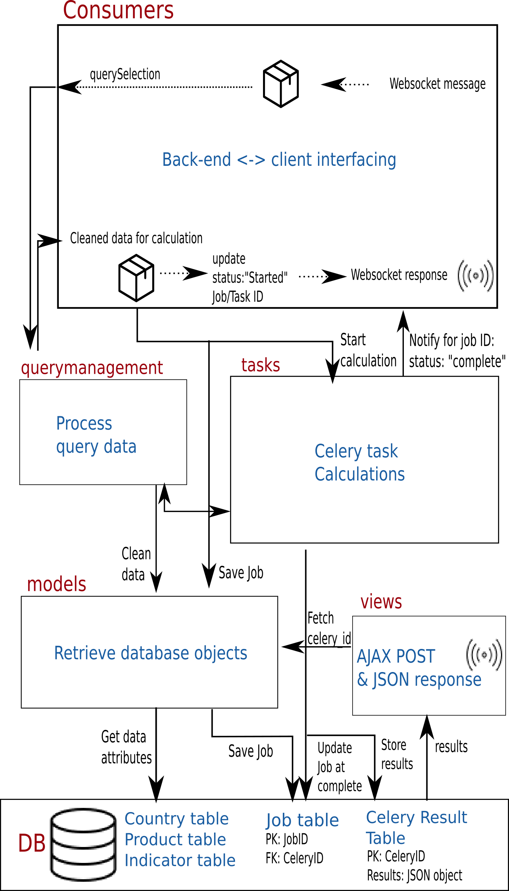

#############
Introduction
#############

RaMa-Scene is a Django+React web-application that allows for analyzing Environmentally Extended Input-Output (EEIO) tables from EXIOBASE v3.3.

The Application Programming Interface (API) layer denotes the communication between front-end
and back-end. Several on-the-fly calculations are performed to generate EEIO results.
The on-the-fly calculations are possible by loading in the EXIOBASE data into memory
and employing background processing.

Implementation overview
=======================
Websockets are used for notifying the user and sending queries to the back-end. In turn Ajax is used to retrieve the final results.
The definition “Task” and “jobs” is important to remember throughout this document.

* “Tasks” are used for front-end notifications of a given query and a “task” is a calculation process in Celery.
* “Jobs” are the database objects used by the back-end to remember which calculation (task) is started by which user.

The back-end can receive two main types of requests from the front-end. A websocket-based request
and a REST/Ajax request. See figure below for an overview of the back-end processes.

Consumers
=========
The module consumers is a Django Channels implementation that handles websockets.
Meaning that the consumers module is next to Ajax the core communication method between front-end and back-end.
The module also invokes query management to process the queries.

Query Management
================
Any query received from the front-end needs to be processed in order to perform calculations and generate result data
in a proper format. This module contains the core functions for doing so.

Tasks
=====
This module is the heart of the EEIO calculations. The Tasks module implements the Celery background processing implementation that allows to process multiple
calculations at the same time, but also calculations that take a long time.

Models
======
Models allows to insert and fetch database objects. It contains mapping coordinates for front-end and back-end communication as well
as the calculation status and results per user.

Views
=====
The views module handles the AJAX POST and JSON result response.

.. _modules: modules.html
.. _python: python-ini.html
.. _initialize: python-ini.html
.. _scripts: python-ini.html