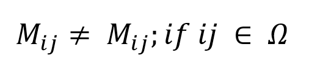
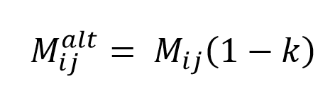
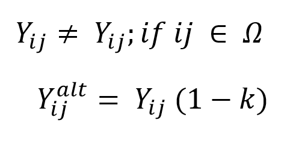
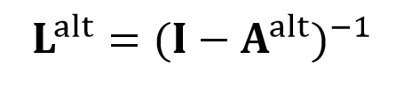
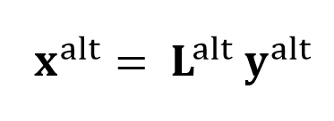

##################
Modelling overview
##################

The following explanations references the ramascene.modelling module code.

General description
===================

In order to create scenarios using EEIO data, operations need to be performed on the source data to obtain their
counterfactual. Counter-factual scenarios are IO tables representing a structure of the economy different
from the baseline structure.
They are constructed by adjusting particular elements in the matrices composing the IO system.

In order to create counter-factual IO tables, the RaMa-SCENE platform takes as a reference A, the technical
coefficient matrix, and Y, the final demand matrix. These two matrices are a representation of the relationship of
input products to outputs (A) and the demand of product outputs by final consumers (Y).

Changes in relationships in the way products are manufactured are therefore implemented by modifying the A matrix,
while variations in the way products are consumed by final consumers are applied on final demand.

Once the A and Y matrix are modified through ramascene.modelling module, they are processed by ramascene.analyze
module so to output results.

Settings
========

Through the interface, under “Scenario Modelling”, users are able to specify the coordinates of the IO elements that
they wish to modify and the magnitude of the change for these intersected values.

The coordinates are defined by row-wise and column-wise items:

Row-wise:

* Product: the supply of a product;
* Originating from: the region that is supplying the product.

Column-wise:

* Consumed by: who is consuming the product, namely final consumers (Y) or a manufacturing activity (S);
* Consumed where: the region in which the consumption of the product is conducted.

The magnitude of the change by which the intersected values are modified is specified under the “Technical Change
Coefficient”. Here both negative and positive relative values can be specified. A negative relative value defines the
reduction that need to be calculated relative to the baseline data while a positive one defines an increase.

Once a set of coordinates and a technical change coefficient are specified, users can add the change.
This can be done iteratively until one is satisfied with the scenario settings. A wrong addition can also be removed through the “Remove last” button.

One the user is satisfied with the settings, they can be saved and applied by pressing the M icon on one of the
previous analyses available under the “Analysis queue” menu.

Processing the settings
=======================

Through the ramascene.modelling module, each added change is processed iteratively. If any change was specified to be
applied in “Y: final consumption” the final demand matrix Y is used as a reference, otherwise the software references
the technical coefficient matrix (A).

The objective of these operations is to obtain a counter-factual final demand matrix **Y** :sup:`alt` and Leontief inverse matrix **L** :sup:`alt`.

The following equation exemplifies how changes in any given matrix are applied:

Where **M** :sub:`ij` is a value of specific coordinates in the matrix of reference M. If the coordinates ij are part of a set of pre-determined coordinates Ω, then **M** :sub:`ij` is different from its baseline.

The selected value is then modified by following this equation:

Where **M** :sub:`ij` :sup:`alt` is the modified value intersected through the coordinates and *k* is the technical change coefficient by which **M** :sub:`ij` is modified.

This process is easily applied to final demand in the following way:

However, in order to obtain a counterfactual Leontief inverse matrix **L** :sup:`alt` , these changes need to be applied to the technical coefficient matrix **A**:

.. image:: ystatic/eq_5_6.PNGmode

From the counter-factual **A** :sup:`alt` the counterfactual **L** :sup:`alt` is calculated by using the following equation:

The total product output is then calculated through the IO equation employing **L** :sup:`alt` and  **Y** :sup:`alt` :

